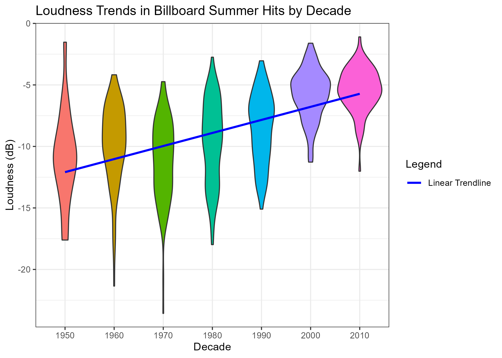
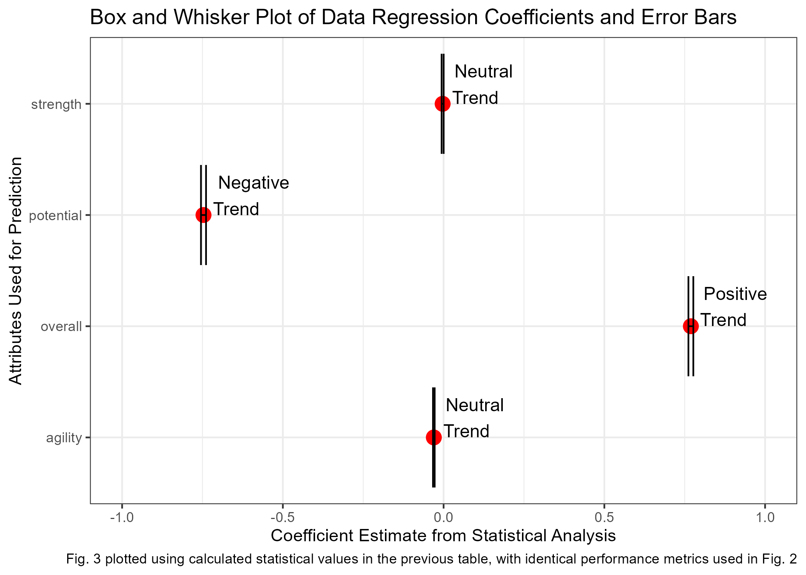
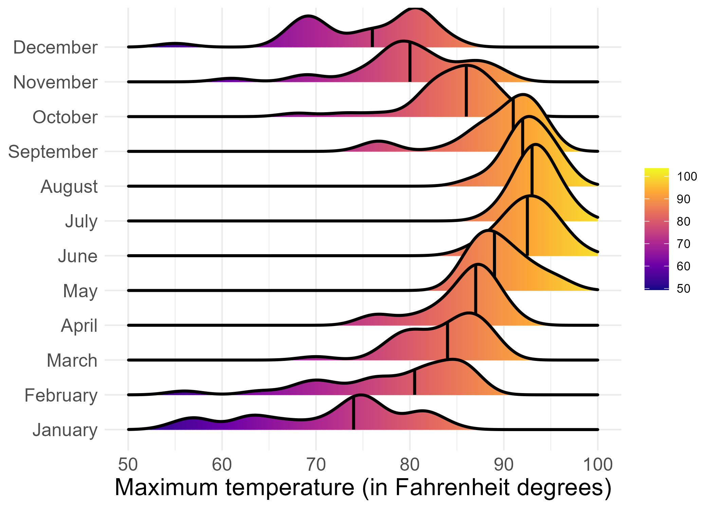

# Data Visualization and Reproducible Research

> Matthew Mathesius. 

The following is a sample of products created during the _"Data Visualization and Reproducible Research"_ course.

## Project 01

In the `project_01/` folder you can find the first Mini Project 1 content that focused on showing trends in summer 
Billboard music between previous decades. This included an analysis on how trends were affected over time, including aspects
such as danceability, energy levels, acousticness, instrumentalness, etc. The showcased plot from this assignment is a violin
plot that dictated loudness across different decades, showing a general increase in decibal ranges over time as seen below.

**Sample data visualization:** 

## Project 02

In this project, I explored the player data presented in the 2018 FIFA video game, comprising of all in-game statistics
of all professional soccer players across the world. Through this project, the primary questions being investigated revolves
around the location of players around the world and an analysis on the effects of age present on player performance. 
This project led to the result of showing that while a player's potential in the league tends to dip over time, their overall
performance is a steady increase up through the player's 30s with a slight decline afterwards. Find the code and report 
in the `project_02/` folder.

**Sample data visualization:** 

## Project 03

In this project, I explored the possibilities of recreating provided visualizations based on Tampa weather data and Rate My Professor
reviews to showcase advanced capabilities in color schemes, formatting, and data manipulation. In the second part of the project, a
text analysis was done to showcase a net positive outlook on the professor in questions based on the provided reviews. All of this 
work is presented in the `project_03/` folder. A sample visualization from this work is presented below, showing the temperature 
distribution in each month in Tampa during 2022. 

**Sample data visualization:** 

### Moving Forward

Through this course, I feel I was able to expand my knowledge and insights into what it truly means to make a good plot. This "good"
sense comes in the form of design choices, preliminary thought into the narrative/story being presented, and proper data manipulation
and formatting to create both sensical, yet ethically presented information. I plan to use these techniques in the immediate future
through anticipated published research to ensure collected data is showcased in an effective manner for a large audience while also
presenting our claims in the correct approach. In addition to this, the concept of the reproducible and replicable standards will be 
kept in mind in ensuring the work I'll be publishing is as replicable as it can be. The content from this course will furthermore be 
carried into industry into the future to replicate these same principles in graphics used for efficient decision making. 
