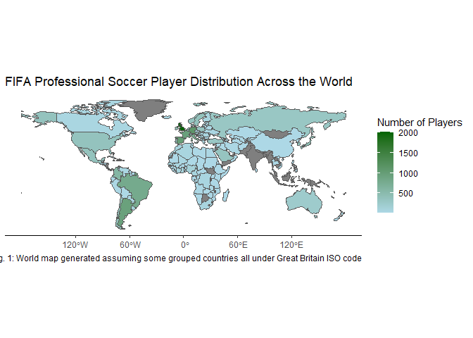
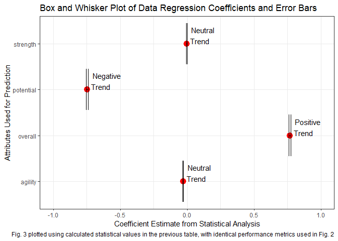
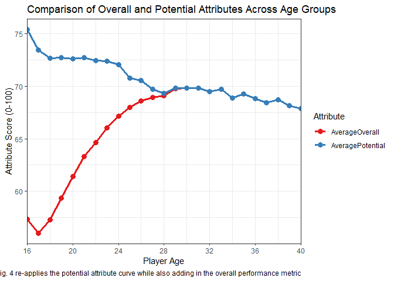

### Outline
&nbsp;&nbsp;&nbsp;&nbsp;&nbsp;&nbsp;&nbsp;&nbsp;This work investigates the varying relations of soccer player data in the 2018 FIFA game release. Trends between player origins, clubs, and provided player statistics will be used to gain insight into the league in this provided year. 

### Motivation
&nbsp;&nbsp;&nbsp;&nbsp;&nbsp;&nbsp;&nbsp;&nbsp;Sports have been a unifying force worldwide for multiple millennia, and the modern day is no exception. Soccer in particular is the largest sport in the world and has gained traction in the majority of the world's countries. With this globalization in mind, the following research questions were generated prior to considering any data visualizations?

1. What countries are producing higher amounts of pro-level players relative to others? Are players being born in that country typically playing for clubs also in that country?
2. How does age play a role in overall player stats and individual performance metrics?

&nbsp;&nbsp;&nbsp;&nbsp;&nbsp;&nbsp;&nbsp;&nbsp;Basing the project on these governing question, initial thoughts revolved around using a heat map to spatially visualize the nationalities of players around the world by using a color scale to relate summed player counts in each country. For the question on age, initial thoughts were to average overall player score and a few individual metrics (agility, strength, and potential) and create an interactive plot where you can see the rankings for any selected age. Finally, for the third question, the intent was to... Through these plots, the following goal was established:

> This project serves the purpose of telling the story of the vast differences between professional soccer players around the world seen through their FIFA rankings. The plots and visualizations herein will attempt to paint this narrative and provide insights to each of the guiding research objectives. 

### Findings from Data Analysis
&nbsp;&nbsp;&nbsp;&nbsp;&nbsp;&nbsp;&nbsp;&nbsp;Strting with the first research question, in order to generate the world map with appropriate player counts, the first necessary step was to read the data set and obtain these counts. The first step of reading the data set is seen below, with the player count table following directly under. The values in this table will be used to validate the mapping visualization is working successfully in the next step of code. 


``` r
suppressMessages(library(tidyverse))
knitr::opts_chunk$set(warning = FALSE, message = FALSE)

FIFA_Data <- read_csv("https://raw.githubusercontent.com/aalhamadani/datasets/main/fifa18.csv", show_col_types = FALSE)

#Will now filter to obtain player counts in each country
NetPlayers <- FIFA_Data %>%
  group_by(nationality) %>%
  summarise(PlayerCount = n()) %>%
  arrange(desc(PlayerCount)) #Arranging in descending order like I had done in Mini Project 1
NetPlayers
```

```
## # A tibble: 162 × 2
##    nationality PlayerCount
##    <chr>             <int>
##  1 England            1516
##  2 Germany            1101
##  3 Spain               989
##  4 France              942
##  5 Argentina           938
##  6 Italy               796
##  7 Brazil              785
##  8 Colombia            578
##  9 Japan               442
## 10 Netherlands         415
## # ℹ 152 more rows
```

&nbsp;&nbsp;&nbsp;&nbsp;&nbsp;&nbsp;&nbsp;&nbsp;With the net players obtained for each country, it is shown England has the largest representation. When plotting the map, that will be used as an indicator to ensure the color scheme is plotting correctly. To get the map now, the sf library was added in addition to an ISO country code library since those are not provided in the original data set. This was done to match the formatting used in the course material for Week 4. There were some issues arising specifically from the United Kingdom with multiple countries being under 1 ISO code, so that was handled through manually grouping them and then summing in the summarized data set. The end result of this is the map presented in Fig. 1. Analyzing the results, one of the most intriguing data points comes in the form of India. Despite being one of the most populated countries in the world, there is no representation from this country, indicating a lack of cultural affiliation for soccer in India relative to other things.Additionally, due to the grouping of countries into Great Britain in addition to the already large presence in England, this region yielded a significantly higher count relative to other geographic regions. 


``` r
library(sf)
library(countrycode)

WorldShape <- read_sf("data/ne_110m_admin_0_countries.shp")
WorldShape <- WorldShape %>%
  mutate(ISO_A3 = countrycode(ADMIN, "country.name", "iso3c"))

MissingMappingCodes <- c("England" = "GBR",
                    "Scotland" = "GBR",
                    "Wales" = "GBR",
                    "Northern Ireland" = "GBR",
                    "Kosovo" = "XKX")

NetPlayers <- NetPlayers %>%
  mutate(ISO_A3 = countrycode(nationality, "country.name", "iso3c"),
         ISO_A3 = ifelse(nationality %in% names(MissingMappingCodes), 
                         MissingMappingCodes[nationality], ISO_A3))

NetPlayers <- NetPlayers %>%
  group_by(ISO_A3) %>%
  summarize(PlayerCount = sum(PlayerCount, na.rm = TRUE))

FilteredMap <- WorldShape %>%
  left_join(NetPlayers %>% select(ISO_A3, PlayerCount), by = "ISO_A3") %>%
  filter(ISO_A3 != "ATA")

ggplot(FilteredMap) +
  geom_sf(aes(fill = PlayerCount)) +
  scale_fill_gradient(low = "lightblue", high = "darkgreen") + 
  labs(title = "FIFA Professional Soccer Player Distribution Across the World",
       fill = "Number of Players", 
      caption = "Fig. 1: World map generated assuming some grouped countries all under Great Britain ISO code") +
  theme_classic()
```

<!-- -->

``` r
ggsave("Fig1_MiniProject2.png")
```

&nbsp;&nbsp;&nbsp;&nbsp;&nbsp;&nbsp;&nbsp;&nbsp;To begin analyzing the question of age rather than region, players were grouped based on their age in the 2018 season. From here, the average score for their overall, potential, agility, and strength attribute was tabulated and reported in the below table for each age. The primary findings here are listed below:

a) Age data is only fully uniform between 16-40. Past 40 there are gaps showing no player in the league was that age. Due to this, data will only be viewed in this window.
b) Overall and potential scores are very similar, especially as age increases. Due to this, the overall stat was selected to not be plotted in the next steps of data visualization. 

&nbsp;&nbsp;&nbsp;&nbsp;&nbsp;&nbsp;&nbsp;&nbsp;Using these findings and slightly morphing the scope of the plot accordingly, an interactive line plot was generated in Fig. 2 to show these trends between younger and older players. The trends show that players between their teens and early 30s shows scalable improvement in both agility and strength, but past this point yields considerable losses (most notably in agility). This trend is logical in nature, as players in their 20s are both gaining more skill and are in their potential physical prime relative to a player in their 30s or older. Potential, on the other hand, shows a slight and consistent decline as players in the league get older. This is likely due to potential factoring in their future career, wth younger players showing likelihood to continue playing and expanding their skill-sets longer than an older player (even if the older player in fact has more skill). The interactive nature of this plot allows users to view the average scores for each given age group across the different attributes


``` r
AgeStats <- FIFA_Data %>%
  group_by(age) %>%
  summarize(
    AverageOverall = mean(overall, na.rm = TRUE),
    AveragePotential = mean(potential, na.rm = TRUE),
    AverageAgility = mean(agility, na.rm = TRUE),
    AverageStrength = mean(strength, na.rm = TRUE),
  ) %>%
  distinct(age, .keep_all = TRUE) 

AgeStats
```

```
## # A tibble: 29 × 5
##      age AverageOverall AveragePotential AverageAgility AverageStrength
##    <dbl>          <dbl>            <dbl>          <dbl>           <dbl>
##  1    16           57.3             75.4           61.1            48.9
##  2    17           56.0             73.5           58.7            51.8
##  3    18           57.3             72.6           59.7            54.5
##  4    19           59.4             72.7           61.0            57.8
##  5    20           61.4             72.6           62.0            59.6
##  6    21           63.3             72.7           62.7            61.0
##  7    22           64.7             72.5           64.3            62.7
##  8    23           66.0             72.4           64.0            65.1
##  9    24           67.1             72.0           65.1            66.6
## 10    25           68.0             70.8           65.7            67.0
## # ℹ 19 more rows
```

``` r
library(plotly)
library(RColorBrewer)

AgeStatsFiltered <- AgeStats %>%
  filter(age >= 16, age <= 40) %>%
  pivot_longer(cols = c(AveragePotential, AverageAgility, AverageStrength),
               names_to = "Attribute", values_to = "Score") %>%
  mutate(Attribute = factor(Attribute, levels = c("AveragePotential", "AverageStrength", "AverageAgility")))

SteadyPlot <- ggplot(AgeStatsFiltered, aes(x = age, y = Score, color = Attribute)) +
  geom_line(size = 1.2) +
  geom_point(size = 3) +  
  scale_color_brewer(palette = "Set1") +
  scale_x_continuous(limits = c(16, 40), expand = c(0, 0), breaks = seq(16, 40, by = 4)) +
  labs(title = "How Player Attributes Change with Age in FIFA Soccer Players",
       x = "Player Age",
       y = "Attribute Score (0-100)",
       color = "Attribute",
       caption = "Fig. 2 interactive nature designed to view exact values for scores at each unique age") +
  theme_bw()

InteractivePlot=ggplotly(SteadyPlot)

InteractivePlot
```

```{=html}
<div class="plotly html-widget html-fill-item" id="htmlwidget-1a4a8504055af55b3ed3" style="width:672px;height:480px;"></div>
<script type="application/json" data-for="htmlwidget-1a4a8504055af55b3ed3">{"x":{"data":[{"x":[16,17,18,19,20,21,22,23,24,25,26,27,28,29,30,31,32,33,34,35,36,37,38,39,40],"y":[75.416666666666671,73.45381526104417,72.64153846153846,72.732435033686244,72.599159663865549,72.706504065040647,72.464541832669326,72.403641881638848,72.038491751767481,70.793463143254513,70.56283185840708,69.685032139577601,69.322515212981742,69.809302325581399,69.834666666666664,69.835748792270536,69.497933884297524,69.71621621621621,68.875486381322958,69.278688524590166,68.838709677419359,68.41538461538461,68.727272727272734,68.15789473684211,67.857142857142861],"text":["age: 16<br />Score: 75.41667<br />Attribute: AveragePotential","age: 17<br />Score: 73.45382<br />Attribute: AveragePotential","age: 18<br />Score: 72.64154<br />Attribute: AveragePotential","age: 19<br />Score: 72.73244<br />Attribute: AveragePotential","age: 20<br />Score: 72.59916<br />Attribute: AveragePotential","age: 21<br />Score: 72.70650<br />Attribute: AveragePotential","age: 22<br />Score: 72.46454<br />Attribute: AveragePotential","age: 23<br />Score: 72.40364<br />Attribute: AveragePotential","age: 24<br />Score: 72.03849<br />Attribute: AveragePotential","age: 25<br />Score: 70.79346<br />Attribute: AveragePotential","age: 26<br />Score: 70.56283<br />Attribute: AveragePotential","age: 27<br />Score: 69.68503<br />Attribute: AveragePotential","age: 28<br />Score: 69.32252<br />Attribute: AveragePotential","age: 29<br />Score: 69.80930<br />Attribute: AveragePotential","age: 30<br />Score: 69.83467<br />Attribute: AveragePotential","age: 31<br />Score: 69.83575<br />Attribute: AveragePotential","age: 32<br />Score: 69.49793<br />Attribute: AveragePotential","age: 33<br />Score: 69.71622<br />Attribute: AveragePotential","age: 34<br />Score: 68.87549<br />Attribute: AveragePotential","age: 35<br />Score: 69.27869<br />Attribute: AveragePotential","age: 36<br />Score: 68.83871<br />Attribute: AveragePotential","age: 37<br />Score: 68.41538<br />Attribute: AveragePotential","age: 38<br />Score: 68.72727<br />Attribute: AveragePotential","age: 39<br />Score: 68.15789<br />Attribute: AveragePotential","age: 40<br />Score: 67.85714<br />Attribute: AveragePotential"],"type":"scatter","mode":"lines+markers","line":{"width":4.5354330708661417,"color":"rgba(228,26,28,1)","dash":"solid"},"hoveron":"points","name":"AveragePotential","legendgroup":"AveragePotential","showlegend":true,"xaxis":"x","yaxis":"y","hoverinfo":"text","marker":{"autocolorscale":false,"color":"rgba(228,26,28,1)","opacity":1,"size":11.338582677165356,"symbol":"circle","line":{"width":1.8897637795275593,"color":"rgba(228,26,28,1)"}},"frame":null},{"x":[16,17,18,19,20,21,22,23,24,25,26,27,28,29,30,31,32,33,34,35,36,37,38,39,40],"y":[48.916666666666664,51.847389558232933,54.503076923076925,57.771896053897976,59.615126050420166,60.985365853658536,62.748207171314739,65.05993930197269,66.633150039277297,67.035465924895689,67.963716814159298,68.432506887052341,70.197768762677484,68.992558139534879,70.524000000000001,70.283413848631241,70.431818181818187,68.663851351351354,69.92607003891051,70.601092896174862,67.403225806451616,66.646153846153851,65.666666666666671,66.736842105263165,60.142857142857146],"text":["age: 16<br />Score: 48.91667<br />Attribute: AverageStrength","age: 17<br />Score: 51.84739<br />Attribute: AverageStrength","age: 18<br />Score: 54.50308<br />Attribute: AverageStrength","age: 19<br />Score: 57.77190<br />Attribute: AverageStrength","age: 20<br />Score: 59.61513<br />Attribute: AverageStrength","age: 21<br />Score: 60.98537<br />Attribute: AverageStrength","age: 22<br />Score: 62.74821<br />Attribute: AverageStrength","age: 23<br />Score: 65.05994<br />Attribute: AverageStrength","age: 24<br />Score: 66.63315<br />Attribute: AverageStrength","age: 25<br />Score: 67.03547<br />Attribute: AverageStrength","age: 26<br />Score: 67.96372<br />Attribute: AverageStrength","age: 27<br />Score: 68.43251<br />Attribute: AverageStrength","age: 28<br />Score: 70.19777<br />Attribute: AverageStrength","age: 29<br />Score: 68.99256<br />Attribute: AverageStrength","age: 30<br />Score: 70.52400<br />Attribute: AverageStrength","age: 31<br />Score: 70.28341<br />Attribute: AverageStrength","age: 32<br />Score: 70.43182<br />Attribute: AverageStrength","age: 33<br />Score: 68.66385<br />Attribute: AverageStrength","age: 34<br />Score: 69.92607<br />Attribute: AverageStrength","age: 35<br />Score: 70.60109<br />Attribute: AverageStrength","age: 36<br />Score: 67.40323<br />Attribute: AverageStrength","age: 37<br />Score: 66.64615<br />Attribute: AverageStrength","age: 38<br />Score: 65.66667<br />Attribute: AverageStrength","age: 39<br />Score: 66.73684<br />Attribute: AverageStrength","age: 40<br />Score: 60.14286<br />Attribute: AverageStrength"],"type":"scatter","mode":"lines+markers","line":{"width":4.5354330708661417,"color":"rgba(55,126,184,1)","dash":"solid"},"hoveron":"points","name":"AverageStrength","legendgroup":"AverageStrength","showlegend":true,"xaxis":"x","yaxis":"y","hoverinfo":"text","marker":{"autocolorscale":false,"color":"rgba(55,126,184,1)","opacity":1,"size":11.338582677165356,"symbol":"circle","line":{"width":1.8897637795275593,"color":"rgba(55,126,184,1)"}},"frame":null},{"x":[16,17,18,19,20,21,22,23,24,25,26,27,28,29,30,31,32,33,34,35,36,37,38,39,40],"y":[61.083333333333336,58.718875502008032,59.650769230769228,61.025986525505296,62.029411764705884,62.68292682926829,64.317928286852592,64.018968133535665,65.083267871170463,65.694714881780257,65.710619469026554,65.646464646464651,64.133874239350916,64.574883720930231,63.87466666666667,63.268921095008054,60.799586776859506,61.472972972972975,57.412451361867703,57.158469945355193,54.362903225806448,50.261538461538464,53.272727272727273,48.368421052631582,48],"text":["age: 16<br />Score: 61.08333<br />Attribute: AverageAgility","age: 17<br />Score: 58.71888<br />Attribute: AverageAgility","age: 18<br />Score: 59.65077<br />Attribute: AverageAgility","age: 19<br />Score: 61.02599<br />Attribute: AverageAgility","age: 20<br />Score: 62.02941<br />Attribute: AverageAgility","age: 21<br />Score: 62.68293<br />Attribute: AverageAgility","age: 22<br />Score: 64.31793<br />Attribute: AverageAgility","age: 23<br />Score: 64.01897<br />Attribute: AverageAgility","age: 24<br />Score: 65.08327<br />Attribute: AverageAgility","age: 25<br />Score: 65.69471<br />Attribute: AverageAgility","age: 26<br />Score: 65.71062<br />Attribute: AverageAgility","age: 27<br />Score: 65.64646<br />Attribute: AverageAgility","age: 28<br />Score: 64.13387<br />Attribute: AverageAgility","age: 29<br />Score: 64.57488<br />Attribute: AverageAgility","age: 30<br />Score: 63.87467<br />Attribute: AverageAgility","age: 31<br />Score: 63.26892<br />Attribute: AverageAgility","age: 32<br />Score: 60.79959<br />Attribute: AverageAgility","age: 33<br />Score: 61.47297<br />Attribute: AverageAgility","age: 34<br />Score: 57.41245<br />Attribute: AverageAgility","age: 35<br />Score: 57.15847<br />Attribute: AverageAgility","age: 36<br />Score: 54.36290<br />Attribute: AverageAgility","age: 37<br />Score: 50.26154<br />Attribute: AverageAgility","age: 38<br />Score: 53.27273<br />Attribute: AverageAgility","age: 39<br />Score: 48.36842<br />Attribute: AverageAgility","age: 40<br />Score: 48.00000<br />Attribute: AverageAgility"],"type":"scatter","mode":"lines+markers","line":{"width":4.5354330708661417,"color":"rgba(77,175,74,1)","dash":"solid"},"hoveron":"points","name":"AverageAgility","legendgroup":"AverageAgility","showlegend":true,"xaxis":"x","yaxis":"y","hoverinfo":"text","marker":{"autocolorscale":false,"color":"rgba(77,175,74,1)","opacity":1,"size":11.338582677165356,"symbol":"circle","line":{"width":1.8897637795275593,"color":"rgba(77,175,74,1)"}},"frame":null}],"layout":{"margin":{"t":43.762557077625573,"r":7.3059360730593621,"b":40.182648401826491,"l":37.260273972602747},"plot_bgcolor":"rgba(255,255,255,1)","paper_bgcolor":"rgba(255,255,255,1)","font":{"color":"rgba(0,0,0,1)","family":"","size":14.611872146118724},"title":{"text":"How Player Attributes Change with Age in FIFA Soccer Players","font":{"color":"rgba(0,0,0,1)","family":"","size":17.534246575342465},"x":0,"xref":"paper"},"xaxis":{"domain":[0,1],"automargin":true,"type":"linear","autorange":false,"range":[16,40],"tickmode":"array","ticktext":["16","20","24","28","32","36","40"],"tickvals":[16,20,24,28,32,36,40],"categoryorder":"array","categoryarray":["16","20","24","28","32","36","40"],"nticks":null,"ticks":"outside","tickcolor":"rgba(51,51,51,1)","ticklen":3.6529680365296811,"tickwidth":0.66417600664176002,"showticklabels":true,"tickfont":{"color":"rgba(77,77,77,1)","family":"","size":11.68949771689498},"tickangle":-0,"showline":false,"linecolor":null,"linewidth":0,"showgrid":true,"gridcolor":"rgba(235,235,235,1)","gridwidth":0.66417600664176002,"zeroline":false,"anchor":"y","title":{"text":"Player Age","font":{"color":"rgba(0,0,0,1)","family":"","size":14.611872146118724}},"hoverformat":".2f"},"yaxis":{"domain":[0,1],"automargin":true,"type":"linear","autorange":false,"range":[46.629166666666663,76.787500000000009],"tickmode":"array","ticktext":["50","60","70"],"tickvals":[50,60,70],"categoryorder":"array","categoryarray":["50","60","70"],"nticks":null,"ticks":"outside","tickcolor":"rgba(51,51,51,1)","ticklen":3.6529680365296811,"tickwidth":0.66417600664176002,"showticklabels":true,"tickfont":{"color":"rgba(77,77,77,1)","family":"","size":11.68949771689498},"tickangle":-0,"showline":false,"linecolor":null,"linewidth":0,"showgrid":true,"gridcolor":"rgba(235,235,235,1)","gridwidth":0.66417600664176002,"zeroline":false,"anchor":"x","title":{"text":"Attribute Score (0-100)","font":{"color":"rgba(0,0,0,1)","family":"","size":14.611872146118724}},"hoverformat":".2f"},"shapes":[{"type":"rect","fillcolor":"transparent","line":{"color":"rgba(51,51,51,1)","width":0.66417600664176002,"linetype":"solid"},"yref":"paper","xref":"paper","x0":0,"x1":1,"y0":0,"y1":1}],"showlegend":true,"legend":{"bgcolor":"rgba(255,255,255,1)","bordercolor":"transparent","borderwidth":1.8897637795275593,"font":{"color":"rgba(0,0,0,1)","family":"","size":11.68949771689498},"title":{"text":"Attribute","font":{"color":"rgba(0,0,0,1)","family":"","size":14.611872146118724}}},"hovermode":"closest","barmode":"relative"},"config":{"doubleClick":"reset","modeBarButtonsToAdd":["hoverclosest","hovercompare"],"showSendToCloud":false},"source":"A","attrs":{"53b417fa12e4":{"x":{},"y":{},"colour":{},"type":"scatter"},"53b43a5213f7":{"x":{},"y":{},"colour":{}}},"cur_data":"53b417fa12e4","visdat":{"53b417fa12e4":["function (y) ","x"],"53b43a5213f7":["function (y) ","x"]},"highlight":{"on":"plotly_click","persistent":false,"dynamic":false,"selectize":false,"opacityDim":0.20000000000000001,"selected":{"opacity":1},"debounce":0},"shinyEvents":["plotly_hover","plotly_click","plotly_selected","plotly_relayout","plotly_brushed","plotly_brushing","plotly_clickannotation","plotly_doubleclick","plotly_deselect","plotly_afterplot","plotly_sunburstclick"],"base_url":"https://plot.ly"},"evals":[],"jsHooks":[]}</script>
```

``` r
ggsave("Fig2_MiniProject2.png")
```

&nbsp;&nbsp;&nbsp;&nbsp;&nbsp;&nbsp;&nbsp;&nbsp;Since the overall score was voided from the previous visualization, statistics will be ran on that individual set of data points alongside the other attributes investigated previously. A linear model of the averages exists in Fig. 2, so the statistics ran in the coefficient plot will be used to validate that model and/or discover any new trends that the previous plot missed due to the oversimplification of using averages. The table below shows the previously mentioned statistics, which are plotted further below in Fig. 3. From this analysis, the negative coefficients between potential, strength, and agility all show a lowered performance estimate as age increases. Agility and strength were very close to 0, as the model was attempting to balance the increased region prior to age 35 and the sharp decline after that age group. Potential is a much more negative value, likely due to the continued decrease in score throughout the entire age range.  


``` r
library(tibble)

StartingModel <- lm(age ~ overall + potential + agility + strength, data = FIFA_Data)

StatisticTable <- tibble(
  term = names(coefficients(StartingModel)),
  estimate = coefficients(StartingModel),  
  std.error = summary(StartingModel)$coefficients[, "Std. Error"],  
  conf.low = confint(StartingModel)[,1],  
  conf.high = confint(StartingModel)[,2] 
)

print(StatisticTable)
```

```
## # A tibble: 5 × 5
##   term        estimate std.error conf.low conf.high
##   <chr>          <dbl>     <dbl>    <dbl>     <dbl>
## 1 (Intercept) 29.5       0.223   29.0     29.9     
## 2 overall      0.769     0.00389  0.762    0.777   
## 3 potential   -0.747     0.00402 -0.755   -0.739   
## 4 agility     -0.0304    0.00133 -0.0330  -0.0278  
## 5 strength    -0.00298   0.00164 -0.00619  0.000230
```

``` r
coeff_df <- data.frame(
  term = names(coefficients(StartingModel)),
  estimate = coefficients(StartingModel),
  conf.low = confint(StartingModel)[,1],
  conf.high = confint(StartingModel)[,2]
) %>%
  filter(term != "(Intercept)")

ggplot(coeff_df, aes(x = estimate, y = term)) +
  geom_point(size = 4, color = "red") +
  geom_errorbar(aes(xmin = conf.low, xmax = conf.high), height = 0.2) + 
  scale_x_continuous(limits = c(-1, 1)) +
  geom_text(aes(label = case_when(
    term == "potential" ~ "Negative\nTrend",
    term == "agility" ~ "Neutral\nTrend",
    term == "strength" ~ "Neutral\nTrend",
    term == "overall" ~ "Positive\nTrend"
  )), hjust = -0.2, vjust = 0, size = 4, color = "black") + 
  labs(title = "Box and Whisker Plot of Data Regression Coefficients and Error Bars",
       x = "Coefficient Estimate from Statistical Analysis",
       y = "Attributes Used for Prediction",
       caption = "Fig. 3 plotted using calculated statistical values in the previous table, with identical performance metrics used in Fig. 2") +
  theme_bw()
```

<!-- -->

``` r
ggsave("Fig3_MiniProject2.png")
```

&nbsp;&nbsp;&nbsp;&nbsp;&nbsp;&nbsp;&nbsp;&nbsp;However, the most interesting data point is the positive trend for overall performance. Originally, this was voided from Fig. 2 due to how similar the values were to potential, therefore making it difficult to see on the plot. With this new information, it was elected to plot only overall and potential to view how that appears on the same axes as Fig. 2, as presented below in Fig. 4. What is shown here is that the positive trend in overall performance in the earlier years marks significant increase relative to the slight decline in the 30s age range. The result in Fig. 4 below validates the statistical analysis, showing a large increase in overall metrics prior to meeting the similar decline shown in potential. This explains the net positive coefficient for overall whereas potential was negative due to the constant decline over increased ages. This plot serves as an exercise in proper data analysis and presentation, as without both these graphs, it would be very easy to misconstrue relations between age and overall performance.  


``` r
AgeStatsFiltered <- AgeStats %>%
  filter(age >= 16, age <= 40) %>%
  select(age, AverageOverall, AveragePotential) %>%
  pivot_longer(cols = c(AverageOverall, AveragePotential),
               names_to = "Attribute", values_to = "Score")

ggplot(AgeStatsFiltered, aes(x = age, y = Score, color = Attribute)) +
  geom_line(size = 1.2) +
  geom_point(size = 3) +
  scale_color_brewer(palette = "Set1") +
  scale_x_continuous(limits = c(16, 40), expand = c(0, 0), breaks = seq(16, 40, by = 4)) +
  labs(title = "Comparison of Overall and Potential Attributes Across Age Groups",
       x = "Player Age",
       y = "Attribute Score (0-100)",
       color = "Attribute",
       caption = "Fig. 4 re-applies the potential attribute curve while also adding in the overall performance metric") +
  theme_bw()
```

<!-- -->

``` r
ggsave("Fig4_MiniProject2.png")
```

### Conclusions & Final Remarks
&nbsp;&nbsp;&nbsp;&nbsp;&nbsp;&nbsp;&nbsp;&nbsp;In this analysis of FIFA 2018 player data, the following conclusions were drawn from the data set:

1. Soccer, being the most popular sport in the world, draws players from a majority of the world's countries. The popularity of the sport in countries like England, France, Spain, Brazil, and Argentina resulted in these countries having some of the largest distributions of pro players. 
2. Age in sports can be an interesting phenomenon. While over time one's physical abilities like their speed and strength diminish, technical skills and game intelligence increases significantly, causing balance shifts when attempting to rate an individual player's overall ratings. Although potential and overall score were heavily linked in later years of age development, younger players see rapid growth in overall rating (likely due to simply getting more skilled after being in the league at higher competition levels). 

&nbsp;&nbsp;&nbsp;&nbsp;&nbsp;&nbsp;&nbsp;&nbsp;Through these visualizations, it was attempted to showcase the story of both the universality of the sport across the world and across different age ranges. The initial map was created to show the worldwide response to the game, whereas the age plots showed not only the distribution, but also that those in theirs 30s were still performing considerably relative to younger athletes. While some declines were shown in the data, relatively higher overall scores proved the sport was not impossible for older athletes to excel in. Furthermore, on the younger athlete side, Fig. 4 helped showcase the rapid room for overall growth in earlier phases of development with, in the worst case of the trends, minor stagnation in later years of play. With this work, the universality of sports was presented both in terms of age and nationality, showing that sports are one of the primary ways the world is brought together. 

&nbsp;&nbsp;&nbsp;&nbsp;&nbsp;&nbsp;&nbsp;&nbsp;Reflecting on this work, data visualization principles were followed more evidently than the previous mini project both with respect to analysis and presentation. On the analysis side, plotting the extra visualizations of overall performance after reading the statistical plot prevented misrepresentation of trends that would have otherwise been simple to mistaken. This level of care and precision and data manipulation was not as necessary in the previous mini project and served as a lesson for future work. On the presentation side, more effort was put into scheming in the sense of using the RColorBrewer package to ensure line colors were more distinct from one another compared to defaults. Additionally, legends were modified to ensure the order of appearance was correlated to the height of the line for simple interpretation. Overall, the continued practice of telling stories through data that are easily understandable were practiced in this work and will continue to be considered in the future.
