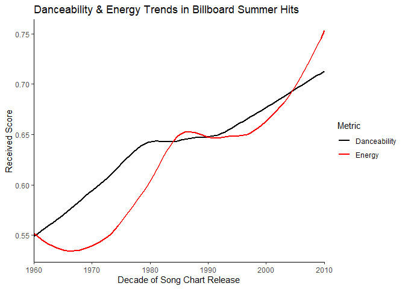
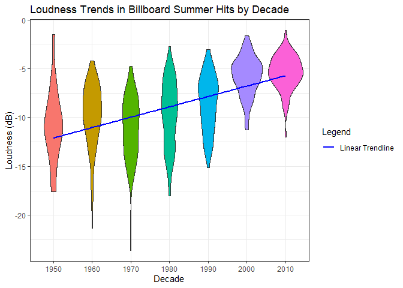
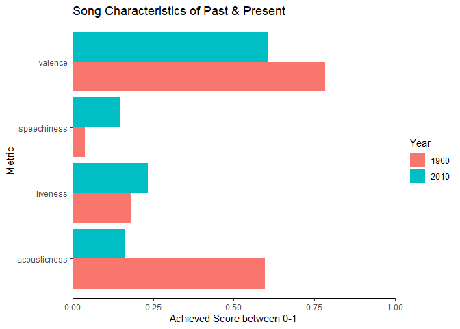
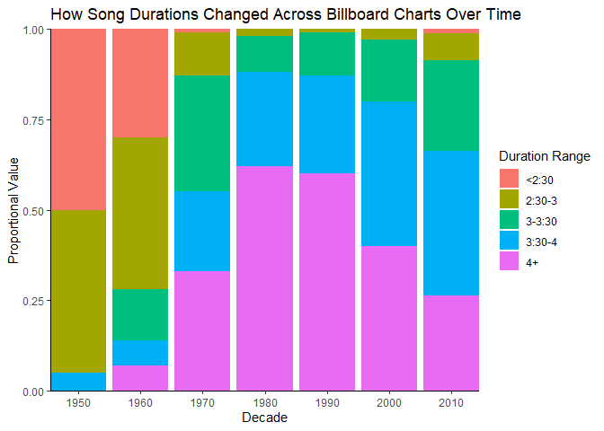

# Data Visualization Mini Project 1

# Establishing Libraries


# Loading the CSV

```
## spc_tbl_ [600 × 22] (S3: spec_tbl_df/tbl_df/tbl/data.frame)
##  $ danceability    : num [1:600] 0.518 0.543 0.541 0.408 0.554 0.679 0.663 0.684 0.645 0.388 ...
##  $ energy          : num [1:600] 0.06 0.332 0.676 0.397 0.189 0.279 0.619 0.556 0.943 0.434 ...
##  $ key             : chr [1:600] "A#" "C" "C" "A" ...
##  $ loudness        : num [1:600] -14.89 -11.57 -7.99 -12.54 -14.28 ...
##  $ mode            : chr [1:600] "major" "major" "major" "major" ...
##  $ speechiness     : num [1:600] 0.0441 0.0317 0.135 0.03 0.0279 0.0384 0.0334 0.0377 0.0393 0.0354 ...
##  $ acousticness    : num [1:600] 0.987 0.669 0.188 0.873 0.915 0.645 0.336 0.468 0.385 0.789 ...
##  $ instrumentalness: num [1:600] 7.87e-06 0.00 8.03e-01 0.00 1.37e-05 0.00 8.61e-06 0.00 0.00 9.54e-01 ...
##  $ liveness        : num [1:600] 0.161 0.134 0.123 0.28 0.132 0.118 0.0622 0.0664 0.37 0.728 ...
##  $ valence         : num [1:600] 0.336 0.795 0.911 0.697 0.214 0.854 0.979 0.867 0.965 0.873 ...
##  $ tempo           : num [1:600] 127.9 155 76.2 72.6 136.7 ...
##  $ track_uri       : chr [1:600] "006Ndmw2hHxvnLbJsBFnPx" "5ayybTSXNwcarDtxQKqvWX" "4jmFSkpcqLOUN6scGU6BOO" "3c7KT5CN8uYRaK3xThhdYt" ...
##  $ duration_ms     : num [1:600] 216373 153933 128360 162773 165293 ...
##  $ time_signature  : num [1:600] 4 4 4 4 3 3 4 4 4 4 ...
##  $ key_mode        : chr [1:600] "A# major" "C major" "C major" "A major" ...
##  $ playlist_name   : chr [1:600] "summer_hits_1958" "summer_hits_1958" "summer_hits_1958" "summer_hits_1958" ...
##  $ playlist_img    : chr [1:600] "https://mosaic.scdn.co/640/5e8c49f7a8d161c1d6510999bd867b6a91640dae6488d1b4d3b17500498b1e648e8a15a663ee1cc08335"| __truncated__ "https://mosaic.scdn.co/640/5e8c49f7a8d161c1d6510999bd867b6a91640dae6488d1b4d3b17500498b1e648e8a15a663ee1cc08335"| __truncated__ "https://mosaic.scdn.co/640/5e8c49f7a8d161c1d6510999bd867b6a91640dae6488d1b4d3b17500498b1e648e8a15a663ee1cc08335"| __truncated__ "https://mosaic.scdn.co/640/5e8c49f7a8d161c1d6510999bd867b6a91640dae6488d1b4d3b17500498b1e648e8a15a663ee1cc08335"| __truncated__ ...
##  $ track_name      : chr [1:600] "Nel blu dipinto di blu" "Poor Little Fool" "Patricia" "Little Star" ...
##  $ artist_name     : chr [1:600] "Domenico Modugno" "Ricky Nelson" "Pérez Prado" "The Elegants" ...
##  $ album_name      : chr [1:600] "Tutto Modugno (Mister Volare)" "Ricky Nelson (Expanded Edition / Remastered)" "El Rey Del Mambo" "Little Star: The Best Of The Elegants" ...
##  $ album_img       : chr [1:600] "https://i.scdn.co/image/5e8c49f7a8d161c1d6510999bd867b6a91640dae" "https://i.scdn.co/image/f0f2c3321ca683bdc121ba039b98c13bbf37d6b2" "https://i.scdn.co/image/6488d1b4d3b17500498b1e648e8a15a663ee1cc0" "https://i.scdn.co/image/83350f7f3e709bffbd6bf47bea2d4132c145484a" ...
##  $ year            : num [1:600] 1958 1958 1958 1958 1958 ...
##  - attr(*, "spec")=
##   .. cols(
##   ..   danceability = col_double(),
##   ..   energy = col_double(),
##   ..   key = col_character(),
##   ..   loudness = col_double(),
##   ..   mode = col_character(),
##   ..   speechiness = col_double(),
##   ..   acousticness = col_double(),
##   ..   instrumentalness = col_double(),
##   ..   liveness = col_double(),
##   ..   valence = col_double(),
##   ..   tempo = col_double(),
##   ..   track_uri = col_character(),
##   ..   duration_ms = col_double(),
##   ..   time_signature = col_double(),
##   ..   key_mode = col_character(),
##   ..   playlist_name = col_character(),
##   ..   playlist_img = col_character(),
##   ..   track_name = col_character(),
##   ..   artist_name = col_character(),
##   ..   album_name = col_character(),
##   ..   album_img = col_character(),
##   ..   year = col_double()
##   .. )
##  - attr(*, "problems")=<externalptr>
```

# Plot 1 - Energy and Danceability Over Time


# Plot 2 - Loudness Distributions Across Each Decade



# Plot 3 - Comparing Song Characteristics from Past & Present



# Plot 4 - Song Durations Over Time


# Data Summary - Artist Total Songs in Descending Order

```
## # A tibble: 468 × 2
##    artist_name        total_songs
##    <chr>                    <int>
##  1 Rihanna                      7
##  2 Elton John                   6
##  3 Katy Perry                   6
##  4 Mariah Carey                 5
##  5 The Rolling Stones           5
##  6 Usher                        5
##  7 Donna Summer                 4
##  8 The Beatles                  4
##  9 Wings                        4
## 10 Bee Gees                     3
## # ℹ 458 more rows
```
